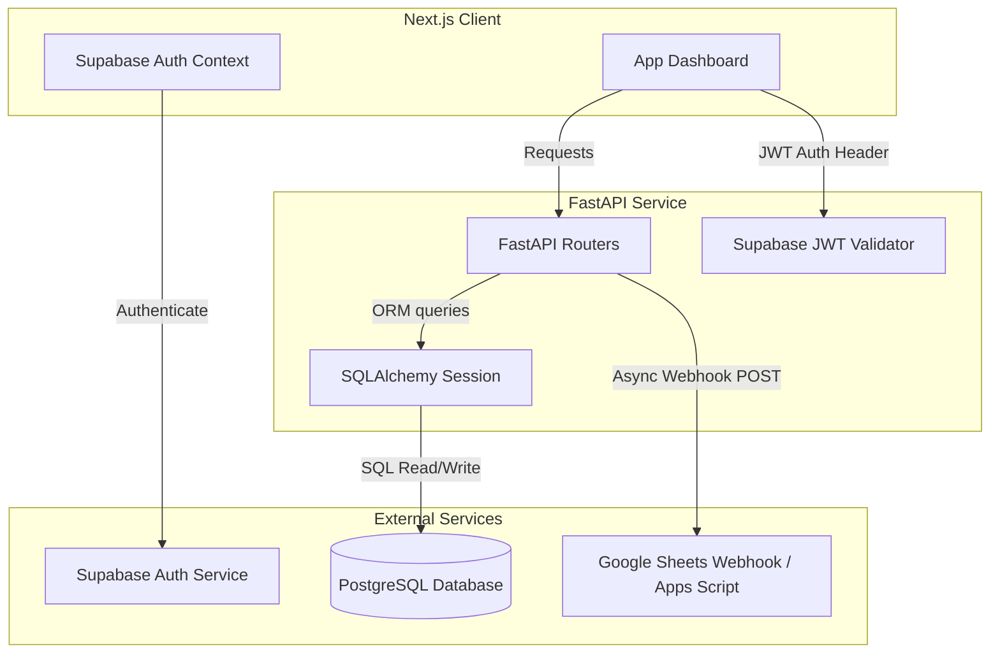
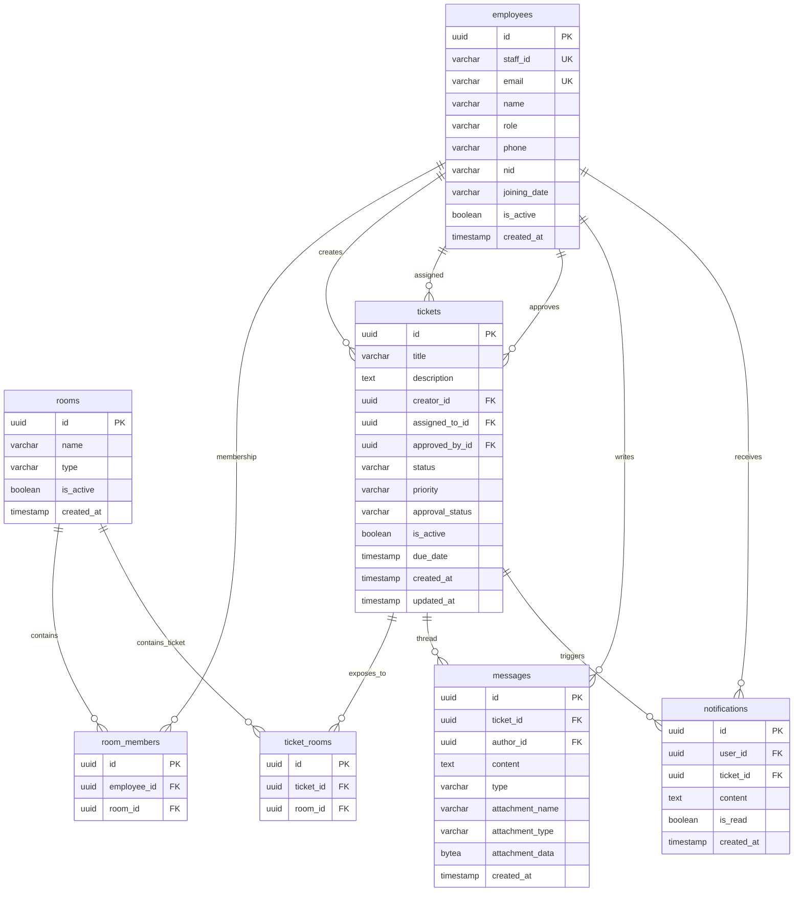
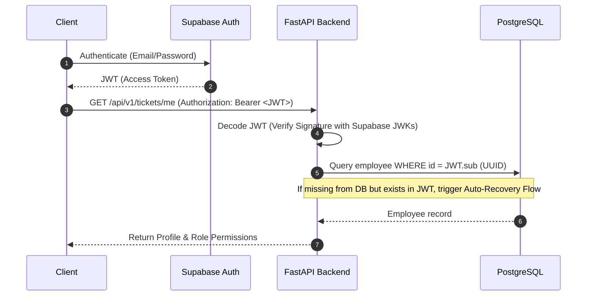

# Core Architecture & System Design Document
**Internal Communication & Ticketing System**
*Technical Reference Manual for Senior Engineering (5+ Years Experience)*

---

## 1. System Overview & Technology Stack

The platform is designed to provide secure, room-bounded threaded communication, ticket assignment, and reporting. The primary architectural constraint is strict alignment with physical operational units (branches/departments) combined with bi-directional spreadsheet synchronization.



### Stack Components
*   **Backend:** FastAPI (Python 3.10+), SQLAlchemy 2.0 ORM, Alembic migrations, Structlog JSON logging, SlowAPI (rate-limiting).
*   **Frontend:** Next.js (App Router, TypeScript), Tailwind CSS, Supabase JS client.
*   **Database:** PostgreSQL (with Supabase acting as Auth provider and Postgres host).
*   **Integrations:** Google Apps Script Webhook for real-time bi-directional database-to-sheet sync.

---

## 2. Database Schema & Relational Design

The system enforces a relational mapping of room-based privacy and single-thread ticket communication.



### Key Models & Custom Property Logic
1.  **`employees` (Employee):** Holds organizational details. 
    *   *Penalties Property:* Dynamically calculates SLA breaches. A user is flagged with `has_penalty` if they have `> 5` active tickets or if any active ticket is past its `due_date`.
2.  **`rooms` (Room) & `room_members`:** Defines authorization boundary. Types are `branch`, `department`, `founder`, and `universal`.
3.  **`tickets` (Ticket):** Encapsulates the task lifecycle. Contains state machines for `status` (`open`, `in_progress`, `approved`, `resolved`) and `approval_status` (`pending`, `approved`, `rejected`).
4.  **`ticket_rooms`:** Supporting cross-room ticketing. A single ticket can map to multiple rooms, granting access to members of either room.
5.  **`messages` (Message):** Supports threaded comments, system events (`status_update`), and binary attachments (stored as `LargeBinary` bytea payloads in the database).

---

## 3. Auth Integration & Security Architecture

The system utilizes Supabase Auth for OAuth2/JWT issuance and handles local database synchronization via shared UUIDs.



### Request Context & Dependency Injection (`deps.py`)
Authentication validation is handled in the `get_current_user` dependency:
1.  **JWT Validation:** Extracts authorization header, decodes the claims using Supabase's project JWT secret, verifying the issuer and expiration.
2.  **Identity Matching:** Queries Postgres based on the `sub` (Subject UUID) claim.
3.  **Dynamic Account Recovery:** If a user successfully authenticates via Supabase Auth but their corresponding record is missing from PostgreSQL (e.g., database wipe, unsynced environment setup), the dependency intercepts this, queries the employee table by `email` (matching the JWT payload), and reconciles the schema by mapping the existing database record ID to the new Supabase Auth UUID.

---

## 4. Google Sheets Bi-Directional Synchronization

Google Sheets serves as the administrative system of record for operational analysis. Synchronization is implemented using real-time HTTP POST webhooks calling Google Apps Script endpoints.

### Webhook Payload Contract
```json
{
  "action": "create" | "update" | "delete",
  "uid": "0001",
  "email": "employee@domain.com",
  "name": "Employee Name",
  "role": "manager",
  "password": "Password123",
  "phn_num": "01317-XXXXXX",
  "joining_date": "21-07-2021"
}
```

### Integration Design & Fail-safes
*   **Asynchronous Processing:** Script synchronization calls from FastAPI endpoints are deferred to FastAPI `BackgroundTasks` to prevent HTTP response blockages on sheet API latency.
*   **In-Place Update Flow:** Rather than destructive clear-and-reset loops, updates use the `update` action payload. The Google Apps Script scans the spreadsheet matching rows by `email` and updates the matching cells, preventing data-wipe intervals.

---

## 5. Mitigation of Database Constraints & Legacy Data Gotchas

### 5.1 Supabase Auth Duplicate Recovery ("Ghost Accounts")
When creating staff profiles, administrators may hit a conflict where a user was previously registered in Supabase Auth (e.g., via a direct sign-up or testing) but does not exist in the Postgres database.
*   **Mechanism:** When `create_user` triggers a `Duplicate Email` exception from Supabase, the handler catches the exception, lists existing users via the Supabase Admin client, retrieves the existing Auth UUID, updates its user metadata/password to the requested settings, and creates a local DB record using that exact Supabase Auth UUID.

### 5.2 Dynamic `staff_id` Auto-increment (Sequence Drift Mitigation)
PostgreSQL serial sequences (`staff_id_seq`) fail when records are manually re-ordered chronologically or backfilled from legacy tables.
*   **Mechanism:** Database sequence generation has been removed in favor of application-level dynamic assignment:
    $$\text{staff\_id} = \text{pad\_left}(\text{COALESCE}(\text{MAX}(\text{CAST}(\text{staff\_id AS INTEGER})), 0) + 1, 4)$$
    This matches the highest numerical value in the database, avoiding IntegrityErrors during updates.

---

## 6. Access Control & Authorization Matrix

Access boundaries are enforced at the API route layer, querying relationships between `employees` and `rooms` dynamically.

| Role | Room Access Policies | Ticket Operations | Administrative Permissions |
| :--- | :--- | :--- | :--- |
| **Owner** | All Rooms (Auto-bypass filters) | Create, View, Assign, Resolve, Approve all | Create/Edit/Deactivate all staff, change passwords |
| **HR** | All Rooms | View all, create tickets, add messages | Read-only staff dashboard |
| **IT Support** | All Rooms | View all, resolve tech issues, add messages | Read-only staff list |
| **Executive** | All Rooms | View all, create tickets, add messages | None |
| **Manager** | Members of branch rooms they manage + general departments | Create/View tickets within their rooms, assign branch staff | Create/Edit therapist & cleaner staff, assign to branch |
| **Staff/Therapist**| Members of assigned branch/department rooms | Create/View tickets within their rooms, assign tickets to self | None |

---

## 7. Frontend Routing, State, & Components

The Next.js frontend uses React Server Components combined with Client Components where interactive state is required.

### Key Routes
*   `/login`: Custom authentication page bypassing Supabase's default UI.
*   `/dashboard`: Aggregated dashboard displaying metrics, pending tickets, and penalties.
*   `/dashboard/staff`: Operational panel for Owners/Managers to administer staff directories, reset passwords, and audit joining dates.
*   `/dashboard/notifications`: Live polling of system alerts.

### State & Component Boundaries
*   **Layout Component (`/dashboard/layout.tsx`):** Maintains the sidebar navigation, extracts the current user context, matches current route contexts, and formats UI elements based on user permissions.
*   **Dialogue Components:** Modal inputs for changing passwords and editing user parameters perform validation schema audits before executing API calls.
